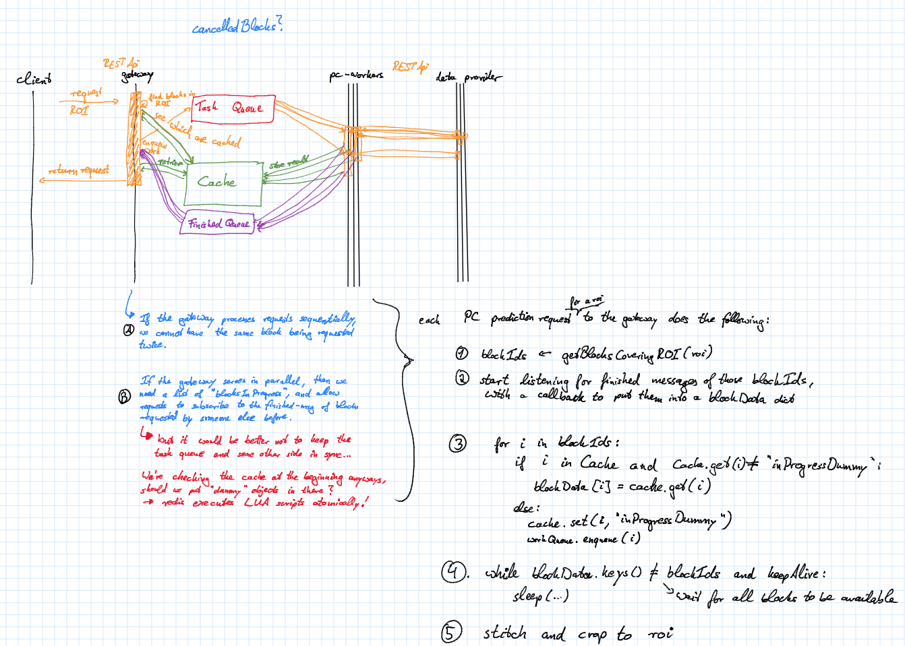

# ilastik backend microservices

This is a prototype for running ilastik as a service (*IaaS?*). Python 3 only!


## Requirements

* Flask: `conda install flask`
* Autodoc (will probably replaced in the future): `pip install Flask-Autodoc`
* Requests: `conda install requests`
* Redis-py: `conda install redis-py`
* The pika RabbitMQ client: `pip install pika`

Additionally, the C++ part of this project must be built with its python bindings:

```sh
git clone https://github.com/chaubold/ilastik-backend.git
cd ilastik-backend
git checkout microservice
git submodule init
git submodule update --recursive
mkdir build
cd build
cmake .. # and configure everything properly, including WITH_PYTHON=TRUE, you need vigra and libhdf5!
make install
```

You also need to run redis and RabbitMQ servers on their default ports for caching and task queues.
Install docker and run the latest redis and rabbitmq in a linux container as follows: 
    
```sh
docker run -d -p 6379:6379 --name redis bitnami/redis:latest
docker run -d --hostname <your host name> -p 4369:4369 -p 25672:25672 -p 5671-5672:5671-5672 --name rabbitmq rabbitmq:3
```

Where the parameters mean:
* `-d` = run as daemon
* `-p` port:port = forward this specific port from the container to localhost (e.g. 6379 is redis default)
* `--name` = provide a name for the container that can be used with start/stop,...

## Running a data provider server

To run a data provider service, serving data by default at port `9000`, execute the line below.
You can access `localhost:9000/doc` in your browser to see an API documentation.

```sh
python dataproviderservice.py --raw-data-file test/raw.h5 --raw-data-path exported_data
```

## Running a pixel classification prediction server

To start the pixel classification prediction server for a little test project and dataset, which listens on the default port `8888`, run:

```sh
python pixelclassificationservice.py --project test/pc.ilp --dataprovider-ip 0.0.0.0:9000 (--verbose)
```

To see the API the client offers, navigate your webbrowser to `localhost:8888/doc`, for instance retrieve the predictions for a roi by

```sh
http://localhost:8888/prediction/png/roi?extents_min=10_10&extents_max=100_150
```

## Running the ilastik gateway

```sh
python ilastikgateway.py --dataprovider-ip 0.0.0.0:9000 --pixelclassification-ip 0.0.0.0:8888
```

## Connecting a Viewer

The `volumina_viewer.py` is taken from [ilastik's voxel-server prototype](https://github.com/ilastik/ilastik/commit/609857c477df050af9d47e5b1a0590051e242280)
and provides a data source for the viewer that retrieves the data from the ilastik gateway.

The volumina viewer must be run from a ilastik development environment as explained in [ilastik-build-conda](https://github.com/ilastik/ilastik-build-conda).
So while data provider and pixel classification run on Python 3, this is must be run using Python 2!

```sh
python volumina_viewer.py --ilastik-ip 0.0.0.0:8080
```

## Proposed communication scheme for prediction blocks:


