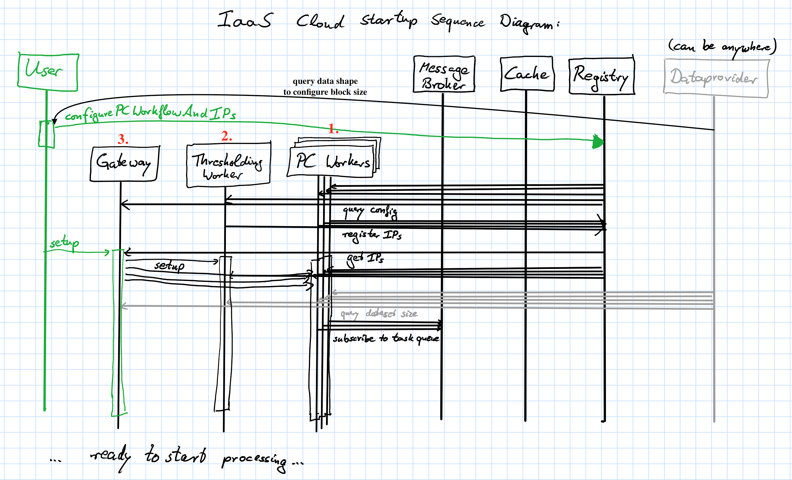

# ilastik backend microservices

This is a prototype for running ilastik as a service (*IaaS?*). Python 3 only!

Several services are working together here, and to ease setup, a central `registry` is created that
contains the configuration of ilastik as well as IPs of workers etc. Hence, starting the services needs
to follow a certain order. All the services listed at the top should be started up front.
Then, the dataprovider IP needs to be stored in the registry, which we do together with some other 
configuration in the `configurePCWorkflow.py` script. Then, pixel classification workers, the thresholding service, and the gateway need to be started in that order. Lastly, a user must call the `/setup` end point of the gateway to finish configuration.




## Requirements

* Flask: `conda install flask`
* Autodoc (will probably replaced in the future): `pip install Flask-Autodoc`
* Requests: `conda install requests`
* Redis-py: `conda install redis-py`
* The pika RabbitMQ client: `pip install pika`

Additionally, the C++ part of this project must be built with its python bindings:

```sh
git clone https://github.com/chaubold/ilastik-backend.git
cd ilastik-backend
git checkout microservice
git submodule init
git submodule update --recursive
mkdir build
cd build
cmake .. # and configure everything properly, including WITH_PYTHON=TRUE, you need vigra and libhdf5!
make install
```

You also need to run redis and RabbitMQ servers on their default ports for caching and task queues.
Additionally, we use a redis instance for service discovery and global configuration (In a professional setup one would use e.g. [etcd](https://github.com/coreos/etcd) or [Consul](https://www.consul.io/) for that).
Install docker and run the latest redis and rabbitmq in a linux container as follows: 
    
```sh
docker run -d -p 6379:6379 --name redis bitnami/redis:latest
docker run -d -p 6380:6379 --name registry bitnami/redis:latest
docker run -d --hostname <your host name> -p 4369:4369 -p 25672:25672 -p 5671-5672:5671-5672 --name rabbitmq rabbitmq:3
```

Where the parameters mean:
* `-d` = run as daemon
* `-p` hostport:containerport = forward this specific port from the container to localhost (e.g. 6379 is redis default)
* `--name` = provide a name for the container that can be used with start/stop,...

## Run a data provider server

To run a data provider service, serving data by default at port `9000`, execute the line below.
You can access `localhost:9000/doc` in your browser to see an API documentation.

```sh
python dataproviderservice.py --raw-data-file test/raw.h5 --raw-data-path exported_data
```

## Configure the project:

This sends the random forest and the feature selection to the registry, and configures pixel classification and thresholding

```sh
python configurePCWorkflow.py --registry-ip 0.0.0.0 --cache-ip 0.0.0.0:6379 --dataprovider-ip 0.0.0.0:9000 --messagebroker-ip 0.0.0.0 --project test/pc.ilp
```

## Start pixel classification and thresholding workers, and the gateway

To start a pixel classification worker (with multiple processing threads) which provides a REST API on the default port `8888`, run:

```sh
python pixelclassificationservice.py --registry-ip 0.0.0.0 (--verbose) (--num-workers=#cores)
python thresholdingservice.py --registry-ip 0.0.0.0 (--verbose)
```

To see the API the client offers, navigate your webbrowser to `localhost:8888/doc`, for instance retrieve the predictions for a roi by

```sh
http://localhost:8888/prediction/png/roi?extents_min=10_10&extents_max=100_150
```


Run the ilastik gateway (at port 8080 by default)

```sh
python ilastikgateway.py --registry-ip 0.0.0.0
```

Now once everything is configured in the registry, call the `/setup` endpoint which lets the PC workers load the random forests, configures the thresholding service and so on:

```sh
wget 0.0.0.0:8080/setup
```

## Connect a Viewer

The `volumina_viewer.py` is taken from [ilastik's voxel-server prototype](https://github.com/ilastik/ilastik/commit/609857c477df050af9d47e5b1a0590051e242280)
and provides a data source for the viewer that retrieves the data from the ilastik gateway.

The volumina viewer must be run from a ilastik development environment as explained in [ilastik-build-conda](https://github.com/ilastik/ilastik-build-conda).
So while data provider and pixel classification run on Python 3, this is must be run using Python 2!

```sh
python volumina_viewer.py --ilastik-ip 0.0.0.0:8080
```

## Implemented communication scheme for blockwise prediction:


