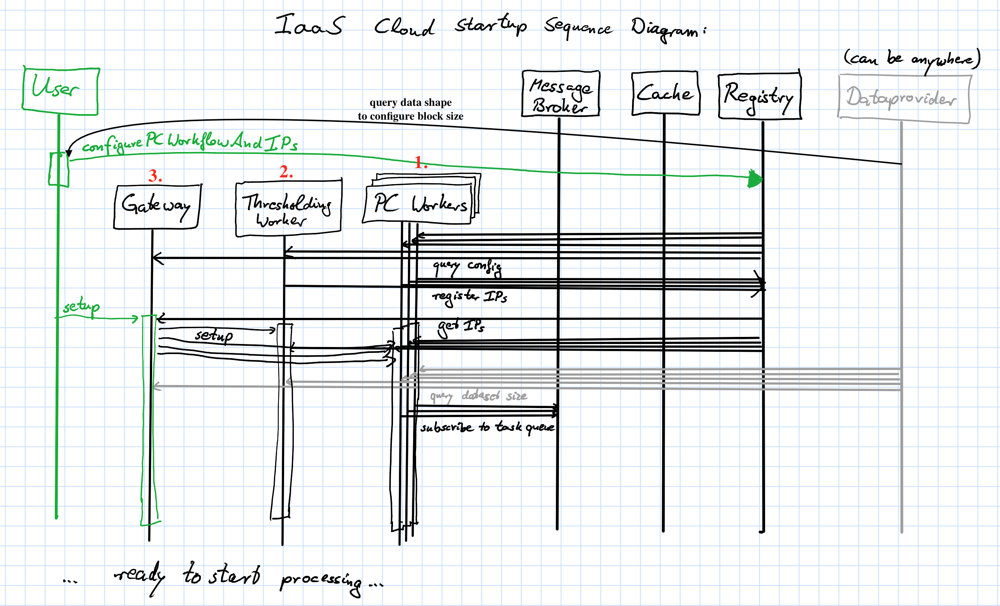
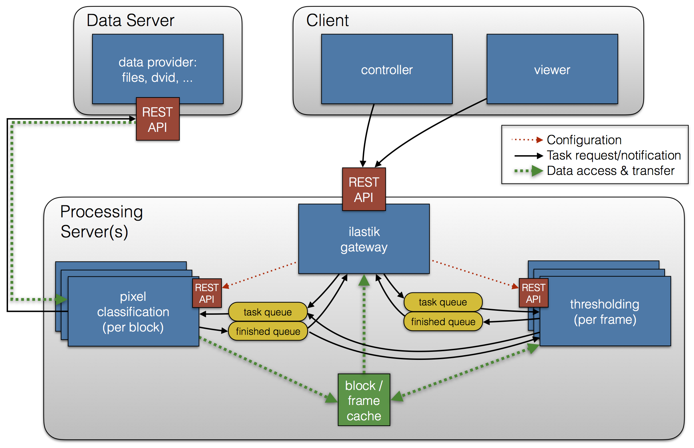
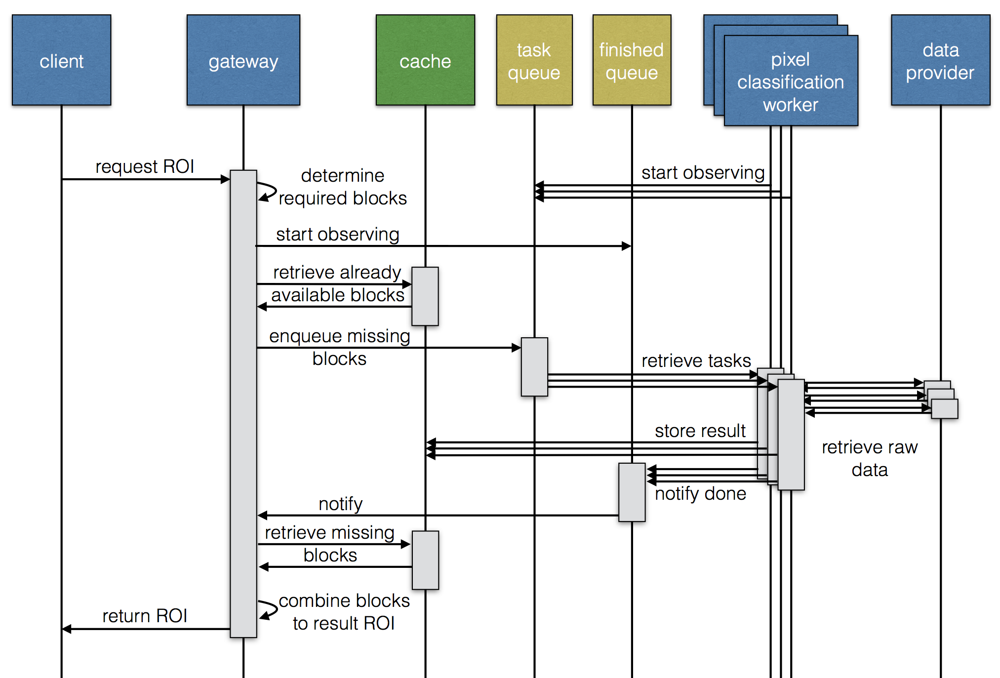
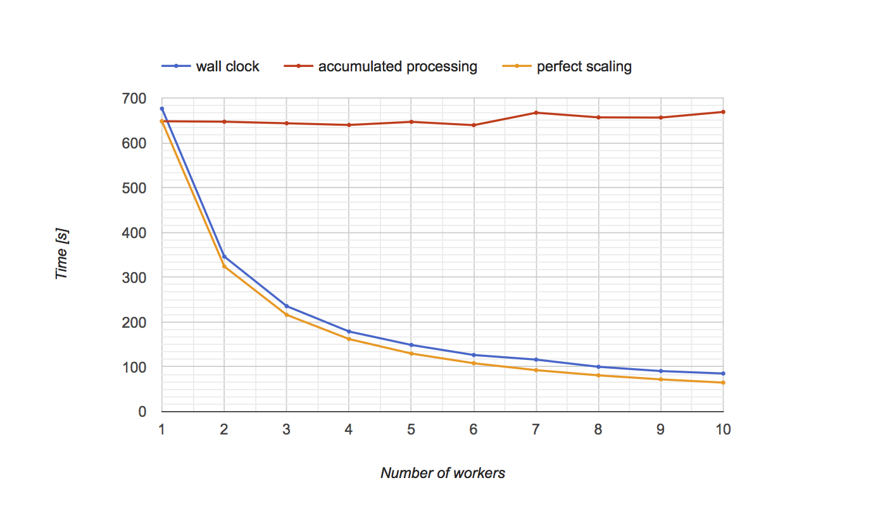

# ilastik backend microservices

This is a prototype for running ilastik as a service (*IaaS?*). Python 3 only!

Several services are working together here, and to ease setup, a central `registry` is created that
contains the configuration of ilastik as well as IPs of workers etc. Hence, starting the services needs
to follow a certain order. All the services listed at the top should be started up front.
Then, the dataprovider IP needs to be stored in the registry, which we do together with some other 
configuration in the `configurePCWorkflow.py` script. Then, pixel classification workers, the thresholding service, and the gateway need to be started in that order. Lastly, a user must call the `/setup` end point of the gateway to finish configuration.




## Requirements

* Flask: `conda install flask`
* Autodoc (will probably replaced in the future): `pip install Flask-Autodoc`
* Requests: `conda install requests`
* Redis-py: `conda install redis-py`

Additionally, the C++ part of this project must be built with its python bindings:

```sh
git clone https://github.com/chaubold/ilastik-backend.git
cd ilastik-backend
git checkout microservice
git submodule init
git submodule update --recursive
mkdir build
cd build
cmake .. # and configure everything properly, including WITH_PYTHON=TRUE, you need vigra and libhdf5!
make install
```

You also need to run two redis servers, one on the default port for caching, and
additionally, we use a redis instance for service discovery, task queues and global configuration (In a professional setup one would use e.g. [etcd](https://github.com/coreos/etcd) or [Consul](https://www.consul.io/) for service discovery).
Install docker and run the latest redis and rabbitmq in a linux container as follows: 
    
```sh
docker run -d -p 6379:6379 --name redis bitnami/redis:latest
docker run -d -p 6380:6379 --name registry bitnami/redis:latest
```

Where the parameters mean:
* `-d` = run as daemon
* `-p` hostport:containerport = forward this specific port from the container to localhost (e.g. 6379 is redis default)
* `--name` = provide a name for the container that can be used with start/stop,...

## Run a data provider server

To run a data provider service, serving data by default at port `9000`, execute the line below.
You can access `localhost:9000/doc` in your browser to see an API documentation.

```sh
python dataproviderservice.py --raw-data-file test/raw.h5 --raw-data-path exported_data
```

## Configure the project:

This sends the random forest and the feature selection to the registry, and configures pixel classification and thresholding

```sh
python configurePCWorkflow.py --registry-ip 0.0.0.0 --cache-ip 0.0.0.0:6379 --dataprovider-ip 0.0.0.0:9000 --project test/pc.ilp
```

## Start pixel classification and thresholding workers, and the gateway

To start a pixel classification worker (with multiple processing threads) which provides a REST API on the default port `8888`, run:

```sh
python pixelclassificationservice.py --registry-ip 0.0.0.0 (--verbose) (--num-workers=#cores)
python thresholdingservice.py --registry-ip 0.0.0.0 (--verbose)
```

To see the API the client offers, navigate your webbrowser to `localhost:8888/doc`, for instance retrieve the predictions for a roi by

```sh
http://localhost:8888/prediction/png/roi?extents_min=10_10&extents_max=100_150
```


Run the ilastik gateway (at port 8080 by default)

```sh
python ilastikgateway.py --registry-ip 0.0.0.0
```

Now once everything is configured in the registry, call the `/setup` endpoint which lets the PC workers load the random forests, configures the thresholding service and so on:

```sh
wget 0.0.0.0:8080/setup
```

## Connect a Viewer

The `volumina_viewer.py` is taken from [ilastik's voxel-server prototype](https://github.com/ilastik/ilastik/commit/609857c477df050af9d47e5b1a0590051e242280)
and provides a data source for the viewer that retrieves the data from the ilastik gateway.

The volumina viewer must be run from a ilastik development environment as explained in [ilastik-build-conda](https://github.com/ilastik/ilastik-build-conda).
So while data provider and pixel classification run on Python 3, this is must be run using Python 2!

```sh
python volumina_viewer.py --ilastik-ip 0.0.0.0:8080
```

## Implemented communication scheme for blockwise prediction:

Architecture for Pixel Classification and Thresholding


Communication sequence diagram


We chose to make all external access, as well as internal configuration calls synchronous via a REST API. The data provider is also accessed via REST. But for the internal distribution of tasks, we employ an asynchronous communication model using task queues and a publish/subscribe pattern for notification about finished tasks, which is sent as soon as results are stored in the central cache. A detailed sequence diagram of how an external request to the gateway fills the pixel classification task queue and collects the probabilities is depicted above. Because the gateway could receive parallel requests that require the same blocks, but which are not processed yet, we design the communication such that no block is processed twice. Every incoming request first determines which blocks are required. Then it starts a block collector thread that listens on the ”block finished” queue for matching blocks. Only then it checks which required blocks are available in the cache and holds on to them. All other blocks are enqueued in the task queue. To prevent the same block to be enqueued multiple times, the first request to schedule a block for processing inserts a placeholder block into the cache that is taken by other requests as indicator that this block is already enqueued. Only as soon as the block collector thread has found all required blocks is the request served to the client. This very scheme is also employed when the thresholding service is asked to process a frame, which then requests and waits for all blocks that belong to the frame. With these steps it is trivial to process multiple tasks in parallel by an unlimited number of workers. For thresholding and object classification requests one can use similar task queue communication, but then tasks represent full frames, not blocks.

# Using the docker image

A dockerimage can be built according to the `Dockerfile`, but is already available on docker hub as [`hcichaubold/ilastikbackend:0.2`](https://hub.docker.com/r/hcichaubold/ilastikbackend/).

It builds on an ubuntu, installs conda, and configures a conda environment to install all required packages (including one for the C++ backend from this repo, available as `conda install ilastikbackend -c chaubold`). Lastly it copies the python files from the `services` folder to the startup folder, and can be run as follows:

```sh
docker run -d -p 8888:8888 --name test hcichaubold/ilastikbackend:0.7 python pixelclassificationservice.py --registry-ip some.ip.goes.here
docker run -d -p 8889:8889 --name test hcichaubold/ilastikbackend:0.7 python thresholdingservice.py --registry-ip some.ip.goes.here
docker run -d -p 8080:8080 --name test hcichaubold/ilastikbackend:0.7 python ilastikgateway.py --registry-ip some.ip.goes.here
```

A note for Mac users if you run docker locally: due to limitations of _Docker for Mac_, running docker containers cannot talk to ports running on the host, neither by `0.0.0.0` nor `localhost`. So use the workaround presented at the bottom of the [Docker Networking Help page](https://docs.docker.com/docker-for-mac/networking/#i-cannot-ping-my-containers) and create some ip alias.

# Deploying to AWS

To automatically start instances running the respective services, you need to make sure that the user which is logged in (specified in `~/.aws/credentials`) has the `AdministratorAccess` policy!

Then, with the `boto3` python module installed via `conda` or `pip`, you can run:

```sh
python startAwsClusterIlastik.py --numPcWorkers 4 --logfile path/where/cluster/log/is/saved/at/shutdown.log --project test/pc.ilp
```

This creates the required roles and permissions, spawns instances, configures the services such that they know the respective IP addresses, and once everything is set up, it waits for the user to press `Ctrl+C` to shut down all instances again.

## Scaling behavior
To test the proposed architecture, we process a 384 × 384 × 192 volume using 64 × 64 × 64 blocks (108 in total) and evaluate the scaling behavior with the number of machines when using 30 features per pixel. 

This shows the total runtime from requesting the thresholding output for the full image until the result is transferred. The pure processing time is very well distributed over the machines, but some overhead remains. As this is only one volume without multiple time steps, thresholding behaves like a global synchronization step. We chose this setup to limit the scaling effects to only one level, because as soon as multiple time frames are requested at the same time, blocks from different frames are competing for pixel classification workers, making it harder to evaluate.

The resulting scaling behavior is nearly perfect, which is even more impressive considering that the total runtime includes the single-threaded thresholding step. This means that our architecture is very well suited to distribute the workload across multiple machines, and that the overhead incurred by data transfer is not affecting the performance much, but even more importantly is nearly constant no matter how many machines are used.
All experiments were run on Amazon Web Services’s Elastic Compute Cloud (AWS EC2), using free tier t2.micro instances with 1 virtual CPU and 1GB RAM, only thresholding was run on a machine with 8GB RAM because even just storing all predictions of the volume requires 2.6GB of memory – which also means this amount of data transfer must have happened between pixel classification workers, cache, and thresholding service. The data provider service was also run on AWS, because data transfers within their network are faster and incur less charges than outbound traffic.
In terms of pure processing runtime, ilastik performs a lot better (≈ 180s without thresholding also on a t2.micro AWS EC2 machine). But a lot of this speed difference can be allotted to a presmoothing step which reduces the feature computation runtime roughly by a factor of two to three. If this was also implemented in our pixel classification service prototype, the runtimes would be even better. Another reason could be that our choice of block size incurs much more redundant feature computations in the margins than that of ilastik (1143). Nevertheless, this has no effect on the near perfect scaling behavior of our architecture with the number of machines
